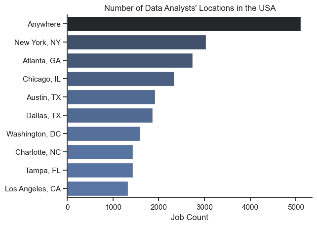
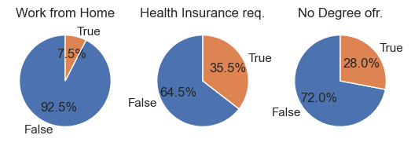
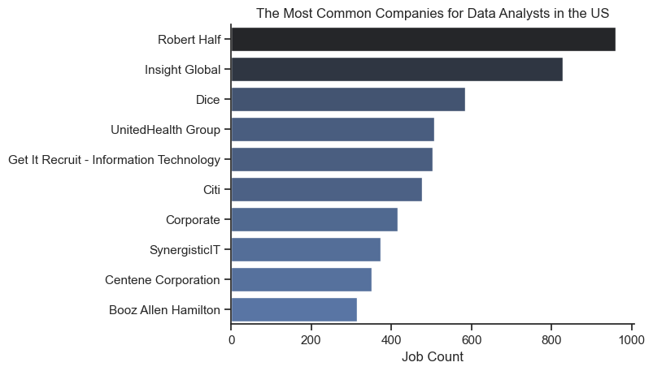
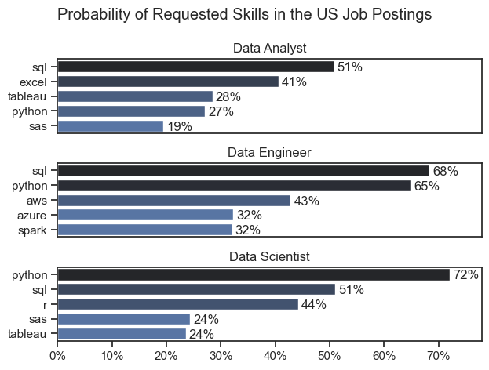
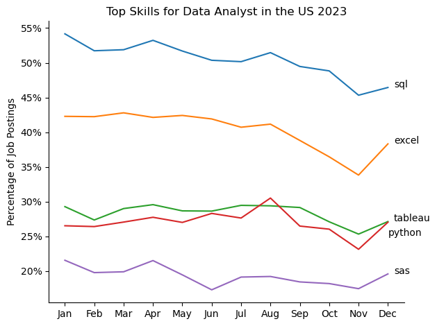
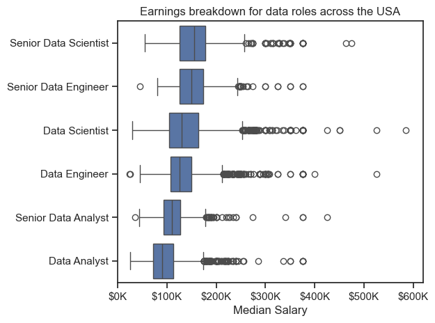
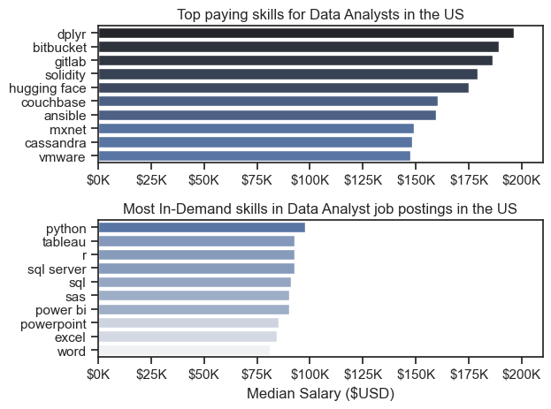
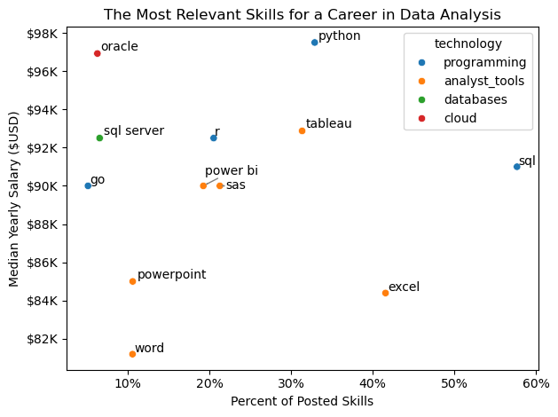

# Overview
This project offers an in-depth look at the data job market, with a particular focus on data analyst positions. It was inspired by a personal goal to better understand and navigate career opportunities in the field. The analysis uncovers the highest-paying and most sought-after skills to help identify ideal job prospects for aspiring data analysts.

The dataset, sourced from Luke Barousse’s Python course, includes valuable information on job titles, salaries, locations, and required skills. Using Python, I addressed key questions such as which skills are most in demand, how salaries vary, and how skill demand aligns with compensation in the world of data analytics.
## The Questions
Key Questions Explored in This Project, which I found useful to answer in Data Analysis

Introduction: 

    1. How many Data Analyst positions are available across the United States?

    2. What are the three main types of workplaces or facilities where Data Analysts are typically employed?

    3. Which companies are the most common or desirable employers for Data Analysts?

Analysis:

    4. What are the Most Demanded Skills for the Top 3 most Popular Data Roles in the US?

    5. What are the trends in skill demand for Data Analysts?

    6. What’s the earning potential for data roles and skills?

    7. What is the median salary for the highest-paying and most in-demand skills for Data Analysts?

    8. Which skills are the most valuable for Data Analysts?

## Tools I used

To explore the data analyst job market in depth, I relied on a range of essential tools and technologies:

• Python – The core language behind my analysis, used to process data and uncover key insights. I worked with several powerful Python libraries:

    • Pandas – For efficient data manipulation and analysis

    • Matplotlib – To create clear, informative visualizations

    • seaborn – For generating advanced, visually appealing charts

• Jupyter Notebooks – Provided an interactive environment where I could run Python code alongside documentation and explanations.

• Visual Studio Code – My primary code editor for writing and running Python scripts.

• Git & GitHub – Used for version control, collaboration, and sharing the project, ensuring smooth tracking and reproducibility.

## Data Preparation and Cleanup

This part details the process of cleaning and organizing the data to ensure it is accurate, consistent, and ready for meaningful analysis.

I begin each session by importing the required libraries and loading the dataset, followed by performing initial cleaning steps to maintain data quality. To keep the analysis relevant to the U.S. job market, I filter the dataset to include only positions located within the United States.
```python
#Importing Libraries
from datasets import load_dataset
import matplotlib.pyplot as plt
import pandas as pd
import ast
import seaborn as sns

#Loading Data
dataset = load_dataset('lukebarousse/data_jobs')
df = dataset['train'].to_pandas()

#Data Cleanup
df['job_posted_date'] = pd.to_datetime(df['job_posted_date'])
df['job_skills'] = df['job_skills'].apply(lambda x: ast.literal_eval(x) if pd.notna(x) else x)
```
```python
df_US = df[df['job_country']=='United States']
```

# Introduction
## 1_How many Data Analyst positions are available across the United States?
To determine the number of Data Analyst positions by location, I first filter the DataFrame to include only rows where the job title is "Data Analyst" and the country is the United States.

Take a look at my notebook here: [EDA_Intro.ipynb](My_DA_Project/EDA_Intro.ipynb)
### Plotting Bar Chart
(not polished)
```python
sns.barplot(data=df_plot, x='count', y=df_plot.index, hue='count', palette='dark:b_r')

plt.show()
```
### Bar Chart


### Insights
• Remote jobs ("Anywhere") dominate the market, offering the most flexibility and the highest number of openings.

• New York, NY leads among physical locations, followed by Atlanta, GA and Chicago, IL.

• Texas is well-represented with both Austin and Dallas in the top six.

## 2_What are the three main types of workplaces or facilities where Data Analysts are typically employed?
This section builds on the previously filtered data but uses a different data, visualized through three pie charts. These charts provide insights into job postings by showing the distribution of workplace facilities—such as remote work availability, health insurance offerings, and degree requirements.

Have a look at my Jupiter notebook here: [EDA_Intro.ipynb](My_DA_Project/EDA_Intro.ipynb)
### Plotting Pie Charts
```python
fig, ax = plt.subplots(1, 3)

job_dict = {'job_work_from_home' : 'Work from Home',
            'job_health_insurance' : 'Health Insurance req.',
            'job_no_degree_mention' : 'No Degree ofr.'}

for i, (column, title) in enumerate(job_dict.items()):
    ax[i].pie(df_DA_US[column].value_counts(), labels=['False','True'], startangle=90, autopct='%1.1f%%')
    ax[i].set_title(title)

plt.show()
```
### Pie Charts


### Insights
• Work from Home is Rare – Only 7.5% of data analyst jobs offer remote work.

• Health Insurance is Optional – 35.5% of listings mention it as a requirement.

• No Degree Needed in Some Cases – 28% of jobs don’t require a formal degree.

## 3_Which companies are the most common or desirable employers for Data Analysts?
This section is also based on the initial-prepared dataset, but here I focused on company names and the number of Data Analyst employees they have. I created and labeled the graph properly for clarity.

If you're interested in reviewing the code, please refer to it: [EDA_Intro.ipynb](My_DA_Project/EDA_Intro.ipynb)

### Plotting Bar Chart
```python
df_plot = df_DA_US['company_name'].value_counts().head(10).to_frame()

sns.set_theme(style='ticks')
sns.barplot(data=df_plot, x='count', y=df_plot.index, hue='count', palette='dark:b_r')
sns.despine()

plt.title('The Most Common Companies for Data Analysts in the US')
plt.ylabel('')
plt.xlabel('Job Count')
plt.legend().set_visible(False)
plt.show()
```
### Bar Chart

### Insights
• Remote roles dominate – “Anywhere” has the highest job count, indicating strong remote opportunities for Data Analysts.

• New York leads cities – Among specific locations, New York, NY has the most openings.

• Southern cities are strong – Atlanta, Austin, and Dallas rank high, showing growth in tech/data jobs outside traditional hubs.

# Analysis
## 4_What are the Most Demanded Skills for the Top 3 most Popular Data Roles in the US?
To identify the most in-demand skills for the top three most popular data roles, I first filtered the dataset to find the most frequently listed positions. Then, I extracted the top five skills associated with each of these roles. This analysis highlights the most common job titles and their key skills, helping me understand which abilities to focus on depending on the role I aim to pursue.

See my Jupiter notebook with algorithm here: [Skill_Demand.ipynb](My_DA_Project/Skill_Demand.ipynb)

### Plotting Graph
[key part]
```python
fig, ax = plt.subplots(len(job_titles), 1)

for i, title in enumerate(job_titles):
    df_plot = df_perc[df_perc['job_title_short']==title].head(5)
    sns.barplot(data=df_plot, y='job_skills', x='skill_percentage', ax=ax[i], hue='skill_count', palette='dark:b_r')

plt.show()
```
### Bar Chart

### Insights
• SQL appears in the top 2 skills for all three roles, with the highest demand for Data Engineers (68%) and Data Analysts (51%).

• Python is the most requested skill for Data Scientists (72%) and the second most requested for Data Engineers (65%).

• Excel (41%) and Tableau (28%) rank high for Data Analysts, reflecting the role’s focus on data visualization and business reporting.

## 5_What are the trends in skill demand for Data Analysts?
To analyze skill trends for Data Analysts in 2023, I filtered job postings for data analyst roles and grouped the listed skills by the month they were posted. This allowed me to identify the top 5 skills for each month, revealing how the demand for specific skills evolved throughout the year.

Check my notebook here: [DA_Skills_Trend.ipynb](My_DA_Project/DA_Skills_Trend.ipynb)

### Plotting graph
(main part of code)
```python
sns.lineplot(data=df_plot, dashes=False, legend='full', palette='tab10')

ax = plt.gca()
ax.yaxis.set_major_formatter(plt.FuncFormatter(lambda y, pos: f'{y:.0f}%'))

plt.tight_layout()
plt.show()

```
### Graph



### Insights

• SQL is the most in-demand skill all year, staying above 45%.

• Excel demand drops steadily, especially after mid-year.

• Python and Tableau are close in demand, both around 25–30%.

## What’s the earning potential for data roles and skills?


### 6_Salary Analysis for Data Jobs

To identify the highest-paying roles, I focused exclusively on US-based data jobs and analyzed their median salaries. I started by examining the salary distribution of common roles—such as Data Scientist, Data Engineer, and Data Analyst—to understand which positions tend to offer the highest pay.

See my notebook here: [Salary_Analysis.ipynb](My_DA_Project/Salary_Analysis.ipynb)

### Plotting graph

```python
sns.boxplot(data=df_plot, x='salary_year_avg', y='job_title_short', order=plot_order)

ax = plt.gca()
ax.xaxis.set_major_formatter(plt.FuncFormatter(lambda x, pos: f'${int(x/1000)}K'))

plt.show()
```
### Box Chart



### Insights
1. Senior Roles Pay Significantly More
Senior positions like Senior Data Scientist and Senior Data Engineer have noticeably higher median salaries compared to their non-senior counterparts, often exceeding $150K.

2. Data Scientists Earn More Than Data Analysts
Even at non-senior levels, Data Scientists have a higher median salary than Data Analysts, indicating a generally more lucrative role.

3. High Salary Variability and Outliers
All roles, especially Data Scientist and Data Engineer, show a wide range of salaries with many outliers above $300K, suggesting high earning potential in certain cases (e.g., in big tech or specialized sectors).

## 7_What is the median salary for the highest-paying and most in-demand skills for Data Analysts?
This time, I focused solely on Data Analyst positions in the U.S. I separated each skill individually and calculated the median salary for each one, along with the number of postings that required it. To visualize the results, I used a previously created table, highlighting both the skills with the highest median salaries and the most frequently listed skills.

Take a look at my notebook here: [Salary_Analysis.ipynb](My_DA_Project/Salary_Analysis.ipynb)

### Plotting graph

(without customization)
```python
fig, ax = plt.subplots(2, 1)

#Top paying skills for Data Analysts in the US
sns.barplot(data=df_skills.sort_values(by='median', ascending=False).head(10), x='median', y='job_skills', ax=ax[0], hue='median', palette='dark:b_r')
#Most In-Demand skills in Data Analyst job postings in the US
sns.barplot(data=df_skills.sort_values(by='count', ascending=False).head(10).sort_values(by='median', ascending=False), x='median', y='job_skills', ax=ax[1], hue='median', palette='light:b')

ax[1].set_title('Most In-Demand skills in Data Analyst job postings in the US')


fig.tight_layout()
plt.show()
```

### Bar Chart


### Insights

• SQL is essential across all three roles, especially for Data Engineers (68%) and Analysts (51%).

• Python is the top skill for Data Scientists (72%) and very important for Engineers (65%).

• Excel and Tableau are more relevant for Data Analysts, reflecting their focus on reporting and visualization.

## 8_Which skills are the most valuable for Data Analysts?
The final part of this project will feature a scatter plot highlighting the most valuable skills for Data Analysts in the US. The graph will display the percentage of job postings requiring each skill on one axis and their associated median salaries on the other. This visualization allows you to identify which skills are both in high demand and well-compensated—helping you choose which ones to focus on, based on insights from a comprehensive dataset covering all of 2023.

See Jupiter Notebook with code here: [Popular_DA_skills.ipynb](My_DA_Project/Popular_DA_skills.ipynb)

### Plotting graph
(no axes customization)
```python
sns.scatterplot(data=plot_table, x='percent', y='median', hue='technology')

labels = []
for i, skill in enumerate(plot_table.index):
    labels.append(plt.text(plot_table['percent'].iloc[i], plot_table['median'].iloc[i], skill))

adjust_text(labels, arrowprops=dict(arrowstyle='->', color='grey'))

plt.tight_layout()
plt.show()
```
### Scatter Graph

### Insights
• Python offers one of the highest median salaries (~$98K) and appears in ~30% of postings—great balance of demand and pay.

• SQL is the most requested skill (57%), with a strong salary (~$92K), making it a must-have.

• Excel is very common (45%) but tied to a lower salary (~$84K)—good to know, but not high-paying.

# What I Learned

This project gave me deeper insight into the data analyst job landscape and allowed me to further develop my technical expertise in Python, particularly in data processing and visualization. Here are some key takeaways:

• Advanced Python Skills: I improved my ability to use libraries like Pandas for handling data, and Seaborn and Matplotlib for creating effective visualizations. These tools made it easier to carry out more complex analysis tasks.

• Value of Data Cleaning: I discovered just how essential data cleaning and preparation are. Accurate analysis depends heavily on having well-structured and reliable data.

• Insight-Driven Skill Strategy: I gained a better understanding of how market demand for specific skills connects with salary and job opportunities—highlighting how important it is to align one's skill set with industry needs for smarter career decisions.

# Challenges I Faced

While working on this project, I encountered several challenges that turned into valuable learning experiences:

• Dealing with Data Issues: Managing missing or inconsistent data was tricky and required careful cleaning and validation to maintain the quality and reliability of the analysis.

• Creating Meaningful Visuals: Building clear and impactful visualizations from complex datasets was demanding, but essential for effectively communicating key insights.

• Finding the Right Focus: Striking a balance between exploring details and maintaining a high-level perspective was challenging. I had to constantly adjust the depth of analysis to ensure both clarity and completeness.

# Key Insights

• SQL and Python are the most valuable skills

    SQL is the most frequently required skill in Data Analyst roles (57% of postings), and Python offers one of the highest median salaries ($98K). Together, they represent a strong combination of high demand and strong compensation.

• Remote positions remain limited

    Despite the increasing trend toward remote work, only about 7.5% of job listings explicitly offer remote options. This suggests that in-office or hybrid roles are still the norm for many companies hiring Data Analysts.

• Senior titles and specialized roles lead in salary

    Senior-level positions, particularly Senior Data Scientists and Senior Data Engineers, offer significantly higher salaries—often exceeding $150K. Even at non-senior levels, Data Scientists tend to earn more than Data Analysts, indicating a higher market value for more technical or specialized roles.

# Special Thanks

I would like to extend my sincere thanks to Luke Barousse for offering a comprehensive Data Analyst course and sharing a rich dataset with his subscribers, including myself. His content was instrumental in building my understanding of Python's role in data analysis and served as the foundation for this project.
I also want to acknowledge ChatGPT, which provided valuable support and guidance throughout the development of this project.

# Conclusion

This project deepened my understanding of the U.S. Data Analyst job market by highlighting the intersection between job demand, skill value, and compensation. Through analyzing real-world job postings, I learned which skills are most sought after, which roles offer the best earning potential, and how trends evolve over time. These insights are not only useful for personal career planning but also for anyone aiming to enter or grow within the data field.
